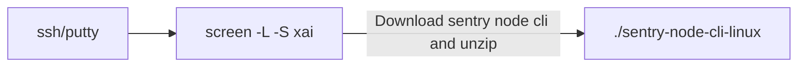
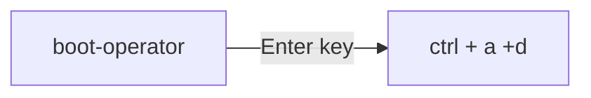
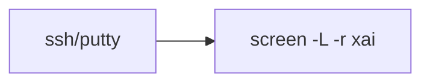
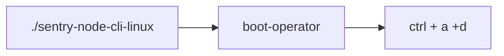

# A thread on how to run @XAI_GAMES nodes.

### Open putty or terminal as per your choice of app

    ssh root@[REPLACE WITH SERVER IP]
    sudo apt update
    sudo apt install curl unzip htop

## Create a new screen session

If this is the first time you are setting up xai node then follow these steps.

> 𝘀𝗰𝗿𝗲𝗲𝗻 -L -𝗦 𝘅𝗮i

Download XAI sentry node cli.

> curl -L -o sentry-node-cli-linux.zip https://github.com/xai-foundation/sentry/releases/latest/download/sentry-node-cli-linux.zip
>
> unzip -o sentry-node-cli-linux.zip

### Run xai node

    ./sentry-node-cli-linux

    𝗯𝗼𝗼𝘁-𝗼𝗽𝗲𝗿𝗮𝘁𝗼𝗿
    Enter your sentry wallet private key

> On successful running the node you will see logs similar like Current timestamp: 2023-12-11T12:22:45.446Z.
> The operator is still running successfully. esXAI will accrue every few days.

### De-attach from xai session

    𝗰𝘁𝗿𝗹 + 𝗮 + 𝗱

## Attach or ch𝗲𝗰𝗸 𝘀𝘁𝗮𝘁𝘂𝘀 𝗼𝗳 𝗻𝗼𝗱𝗲

Login to vps and attach to the xai screen session.

    screen -L -r xai

If you see node logs

> "The operator is still running successfully. esXAI will accrue every few days."

The above logs means node is running successfully.

### 𝗛𝗼𝘄 𝘁𝗼 𝗰𝗹𝗼𝘀𝗲 𝗺𝘂𝗹𝘁𝗶𝗽𝗹𝗲 𝘀𝗰𝗿𝗲𝗲𝗻 𝘀𝗲𝘀𝘀𝗶𝗼𝗻𝘀?

If you see multiple screens like this then run this command.

    screen -S pid.xai -X quit

_Example_

> 𝘀𝗰𝗿𝗲𝗲𝗻 -𝗦 𝟵𝟱𝟵𝟯𝟬.𝘅𝗮𝗶 -𝗫 𝗾𝘂𝗶𝘁

If the node stops then you have to call again

    ./sentry-node-cli-linux
    boot-operator

### Regularly update node software.

    screen -L -r xai

Close existing node by pressing

    ctrl + c
    Type and enter
    𝗲𝘅𝗶𝘁

Download latest node software using these commands.

    curl -L -o sentry-node-cli-linux.zip https://github.com/xai-foundation/sentry/releases/latest/download/sentry-node-cli-linux.zip

    unzip -o sentry-node-cli-linux.zip

#### Start node:

    ./sentry-node-cli-linux
    boot-operator
    ctrl + a +d

### Check esXai balance

#### From Cli

In new terminal run

    ./sentry-node-cli-linux
    𝗴𝗲𝘁-𝗯𝗮𝗹𝗮𝗻𝗰𝗲𝘀

#### In arbscan

     https://arbiscan.io/token/0x4c749d097832de2fecc989ce18fdc5f1bd76700c?a=REPLACE_WITH_YOUR_METAMASK_ID

> https://arbiscan.io/token/0x4c749d097832de2fecc989ce18fdc5f1bd76700c?a=**REPLACE_WITH_YOUR_METAMASK_ID**

## Monitor XAI node + telegram setup

You can use this guide to set up a monitoring script on your VPS CLI node. It will alert you on telegram if the node stops running or if you receive a claim.

> https://github.com/smahe21/Xai-Node-Monitor

## XAI nodes and token contracts

    ES XAI Address: 0x4C749d097832DE2FEcc989ce18fDc5f1BD76700c
    Node License Address: 0xbc14d8563b248B79689ECbc43bBa53290e0b6b66
    XAI Address: 0x4Cb9a7AE498CEDcBb5EAe9f25736aE7d428C9D66
